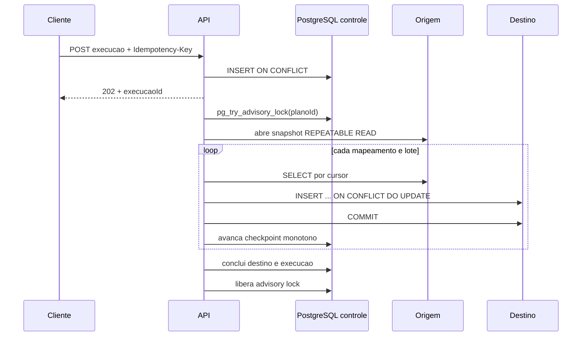

# Arquitetura do DataRelay

## Contexto

O DataRelay copia tabelas PostgreSQL selecionadas para destinos independentes. Ele atende integracoes em lote nas quais o time precisa controlar frequencia, volume, retomada, auditoria e falhas por destino. Nao pretende substituir replicacao fisica do PostgreSQL nem CDC por WAL.

## Modulos

| Modulo | Responsabilidade |
|---|---|
| `connector` | conexoes PostgreSQL e referencias de segredo |
| `plan` | politica, tabelas, colunas, lote e agendamento |
| `execution` | fila, trava, retomada, idempotencia e historico |
| `replication` | validacao do esquema e motor JDBC |
| `shared` | erros HTTP, correlacao e identificadores SQL seguros |

As regras dependem de interfaces do dominio. Os adaptadores JDBC implementam essas portas. O caminho de dados usa JDBC direto porque tabelas e colunas sao definidas em tempo de execucao; modelar cada origem como entidade JPA criaria acoplamento incorreto.

## Fluxo de uma execucao

## Consistencia

O destino confirma cada lote antes do avanco do checkpoint. Se o processo cair entre essas operacoes, o lote sera lido novamente. Essa semantica e **at-least-once**, tornada idempotente pelo `UPSERT`.

O incremental usa a tupla `(coluna_incremental, coluna_chave)` como cursor. A origem e lida em `REPEATABLE READ` ate uma marca superior capturada no inicio. Uma sobreposicao configuravel rele a fronteira recente; o checkpoint so pode avancar e nunca aceita uma marca anterior.

Mapeamentos sao executados por ordem. A validacao usa os metadados JDBC para impedir que uma tabela dependente, como `pedidos`, apareca antes da tabela referenciada, como `clientes`.

## Concorrencia e recuperacao

Uma sessao PostgreSQL do banco de controle mantem uma advisory lock por plano durante toda a execucao. Isso impede duas cargas do mesmo plano, inclusive entre instancias diferentes da aplicacao.

Ao iniciar e periodicamente, o recuperador procura execucoes `EM_EXECUCAO`. Ele tenta obter a mesma trava:

- se a trava estiver ocupada, outra instancia continua responsavel;
- se a trava estiver livre, a execucao anterior foi interrompida e volta para `NA_FILA`;
- tentativas de destino sao reinicializadas e o `UPSERT` permite repetir o lote com seguranca.

## Isolamento de destinos

Cada destino tem checkpoint e resultado proprios. Falha em um destino nao desfaz outro ja concluido. A execucao principal fica `PARCIALMENTE_CONCLUIDA`, e o endpoint de reprocessamento cria uma nova execucao restrita ao destino falho.

## Seguranca

- JWT validado por emissor e JWKS do Keycloak.
- `datarelay.leitura` para consultas e `datarelay.escrita` para comandos.
- sessao HTTP stateless e CSRF desabilitado apenas porque a API usa Bearer Token.
- nomes SQL passam por lista de caracteres permitidos e sao sempre citados.
- senhas sao resolvidas por `env:` e nao entram no banco de controle ou nas respostas.
- erros inesperados sao registrados internamente e devolvidos como Problem Details sem stack trace.
- somente health, documentacao e metricas tecnicas ficam publicos; em producao, o endpoint Prometheus deve permanecer em rede interna.

## Observabilidade

- `X-Correlation-Id` recebido ou gerado por requisicao.
- `execucaoId` no MDC das tarefas assincronas.
- contadores por status, linhas escritas e histogramas de duracao.
- health, readiness, liveness e endpoint Prometheus via Actuator.
- dashboard Grafana provisionado no profile `observability`.

## Limites assumidos na versao 1

- apenas PostgreSQL;
- chave primaria inteira de uma coluna;
- mesmas colunas e familias de tipos entre origem e destino;
- exclusoes fisicas nao sao detectadas;
- o modo completo nao apaga registros exclusivos do destino;
- nenhuma transformacao de valor durante a copia.
